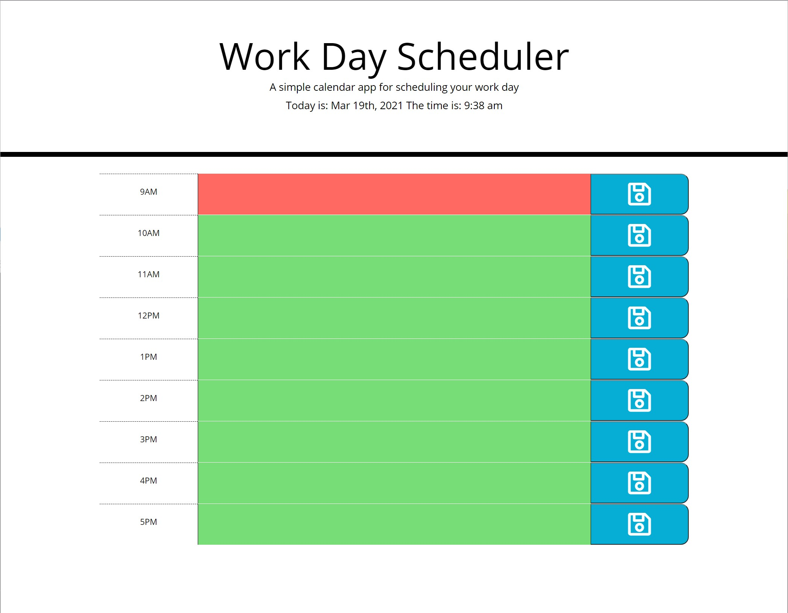

# calendar

## Description 

A simple day planner that allows you to schedule out your days activities. Color coded hour blocks based on the current time lets you see your current scheduled events, past and future events. 
Start organizing your day, today! 

## Git Hub Repo Link
https://github.com/adamnatrop/calendar

## Git Hub Project Live Link
https://adamnatrop.github.io/calendar/

